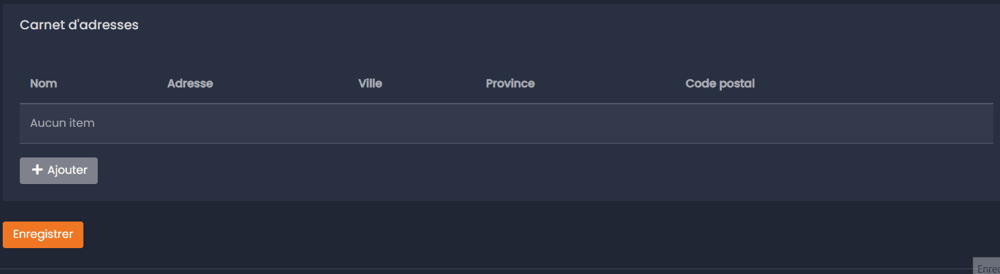

# AddressBundle

Le AddressBundle offre la possibilité d'avoir des champs d'auto-complétion utilisant différentes API pour les formulaires contenant des adresses.



---

## Installation du bundle

1. Installez le bundle via Composer:
```bash
composer require eckinox/address-bundle
```

2. Ajoutez le secret:
```bash
bin/console secrets:set INSERT_CHOSEN_API_NAME_HERE_API_KEY
```
Remplacez `INSERT_CHOSEN_API_NAME` pour l'API choisi. Les API disponibles sont les suivantes: `GOOGLE_PLACES`, `ADDRESS_COMPLETE`.

Pour générer votre clé d'API, veuillez vous référer aux articles ci-dessous:
- [How to install | AddressComplete | Canada Post](https://www.canadapost-postescanada.ca/ac/support/setup-guides/#create-an-api-key)
- [Use API Keys with Places API  |  Google Developers](https://developers.google.com/maps/documentation/places/web-service/get-api-key)

3. Ajouter les routes:  
   Créer un fichier `eckinox_address.yaml` dans le dossier `config/routes` contenant les lignes suivantes:
```
eckinox_address:
    resource: "@EckinoxAddressBundle/config/routes.yaml"
```
---

## Comment utiliser _Address Bundle_

### Créer l'entité

Tout d'abord, créer l'entité qui sera utilisée pour enregistrer les adresses. Pour ce faire, vous n'avez qu'à extend la classe abstraite fournie par le bundle comme suis:

```php
use Eckinox\AddressBundle\Entity\AbstractAddress;

class MyAddressClass extends AbstractAddress
{
    // Just add other needed fields like usual
}
```

Voici la liste des propriétés définies dans `AbstractAddress`:

```php
	protected int $id;
	protected string $name;
	protected string $address;
	protected string $city;
	protected string $province;
	protected string $postalCode;
```

### Utiliser l'auto-complete dans les formulaires

Il y a deux manières d'utiliser les adresses dans vos formulaires:
 - AddressType: Génère un formulaire complet avec les champs de base de l'entité abstraite `AbstractAddress`. (*Fonctionne bien pour une liste d'adresses de base avec le `CollectionListType` fourni par [eckinox/admin-ui-bundle](https://github.com/eckinox/admin-ui-bundle)*).
 - AddressAutocompleteType: Génère un champ de type input, utilisé pour lancer la recherche via l'API choisi et afficher la liste de possibilitées.  

Voici comment les utiliser:

#### **AddressType**

Pour utiliser le formulaire `AddressAutocompleteType` dans vos `FormType`, vous devez:
1. Ajouter `Eckinox\AddressBundle\Form\Type\AddressType;` dans les use de votre formulaire où vous désirez l'afficher.
2. Puis, utiliser `AddressType` et passer l'entité d'`address` désiré à l'aide du paramètre `entry_options` puis lui passer `'data_class' => MyAddressClass::class,` (voir l'exemple ci-dessous).
3. Ajouter, au besoin, l'API désiré avec l'option `api`, l'API de Poste Canada "Address Complete" sera utilisé par défaut.

```php
use Eckinox\AddressBundle\Form\Type\AddressType;
use Symfony\Component\Form\FormBuilderInterface;
use App\Entity\Address;

class MyFormType extends AbstractType
{
    public function buildForm(FormBuilderInterface $builder, array $options): void
    {
        $builder
			// Add fields like you usually would. 
			->add('addresses', CollectionListType::class, [
				'entry_type' => AddressType::class,
				'entry_options' => [
					'data_class' => Address::class,
					'api' => 'addressComplete', 
				],
				'by_reference' => false,
			])
        ;
    }
}
```

#### **AddressAutocompleteType**

Pour utiliser le champ `AddressAutocompleteType` dans vos `FormType`, vous devez:
1. Ajouter `Eckinox\AddressBundle\Form\Type\AddressAutocompleteType` dans vos use.
2. Ajouter votre champ `AddressAutocompleteType` comme vous le feriez avec n'importe quel autre champ.
3. Ajouter les paramètres désirés:
	1. Il est recommandé de désactiver l'autocomplete du champ pour éviter que les propositions du navigateur passent par-dessus les propositions d'autocomplete. Vous n'avez qu'à ajouter l'attribut suivant au champ: `'autocomplete' => uniqid('noautocomplete')`.
	2. Il est possible de passer un paramètre `api` pour choisir l'API à utiliser. Les choix disponibles sont: `addressComplete` ou `googlePlaces`. Si aucun API est spécifié, l'api de Poste Canada "Address Complete" sera utilisé par défaut.

Voici un exemple:
```php
use Symfony\Component\Form\AbstractType;
use Symfony\Component\Form\Extension\Core\Type\TextType;
use Symfony\Component\Form\FormBuilderInterface;
use Symfony\Component\OptionsResolver\OptionsResolver;
use Eckinox\AddressBundle\Form\Type\AddressAutocompleteType;

class AddressType extends AbstractType
{
	public function buildForm(FormBuilderInterface $builder, array $options): void
	{
		$builder
			->add('name', TextType::class)
			->add('address', AddressAutocompleteType::class, [
				'attr' => [
					'autocomplete' => uniqid('noautocomplete'),
				],
				'api' => 'addressComplete', // addressComplete || googlePlaces
			])
			->add('city', TextType::class)
			->add('province', TextType::class)
			->add('postalCode', TextType::class)
		;
	}
```

4. Une fois l'auto-complete ajouté au formulaire, il est possible d'utiliser l'event javascript `populate-address` pour remplir les champs avec les détails de l'adresse (qui se retrouvent dans `event.detail`). L'event est déclenché sur l'élément de row du formulaire, donc dans ce cas-ci, sur `<tr>`. Voici l'event listener utilisé par la liste par défaut qui peut être redéfini et ajusté pour vos besoins spécifiques:

```javascript
this.row.addEventListener('populate-address', (event) => {
	const addressInput = this.input;
	let cityInput = this.row.querySelector('*[data-field-name="city"] input');
	let provinceInput = this.row.querySelector('*[data-field-name="province"] input');
	let postalCodeInput = this.row.querySelector('*[data-field-name="postalCode"] input');

	// in the case where the form would be displayed in a modal
	if (cityInput == null || provinceInput == null || postalCodeInput == null) {
		cityInput = this.row.querySelector('*.city input');
		provinceInput = this.row.querySelector('*.province input');
		postalCodeInput = this.row.querySelector('*.postal-code input');
	}

	addressInput.value = event.detail.address;
	cityInput.value = event.detail.city;
	provinceInput.value = event.detail.province;
	postalCodeInput.value = event.detail.postalCode;
});
```

---

## Fonctionnement

Lorsqu'un champ de type `AddressAutocompleteType` est utilisé dans un formulaire, l'input classique est remplacé par un webcomponent d'autocomplete qui contient le champ utilisé pour la rechercher et la liste qui receveras les résultats de l'API.

Une fois qu'un choix est sélectionné, une autre requête à l'API est lancée et les détails de l'adresse sont retournés. Un event javascript est déclenché et les autres champs d'adresse sont alors remplis.
